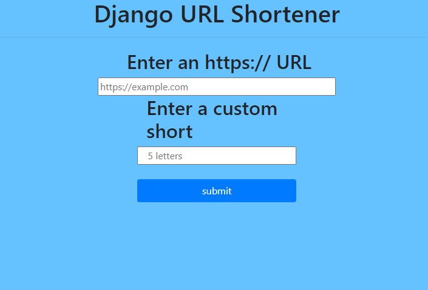

Functional Features - Version 1.0

- Given a URL, our service should generate a shorter and unique alias of it. This is called a short link. 
- When users access a short link, our service should redirect them to the original link. 
- Users should optionally be able to pick a custom short link for their URL. 
- Links will expire after a standard default timespan. ).

Non-Functional Requirements

The system should be highly available. This is required because, if our service is down, all the URL redirections will start failing.
- URL redirection should happen in real-time with minimal latency. 
- Shortened links should not be guessable (not predictable). To achieve this Cronjobs should be enabled. 

Extended Requirements

- Analytics **
- Our service should also be accessible through REST APIs by other services. 

